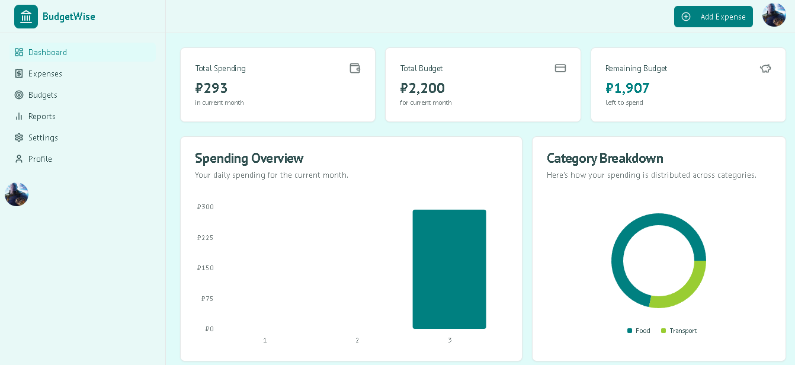
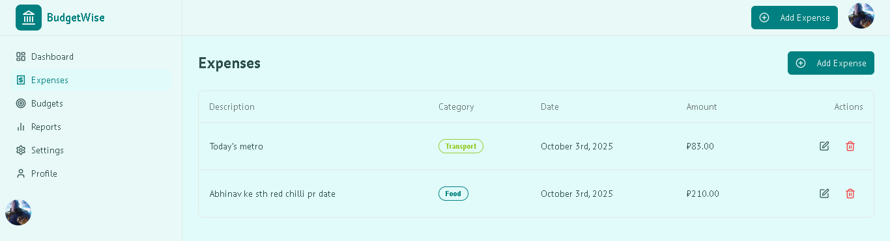
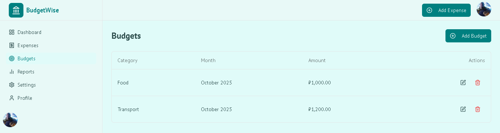
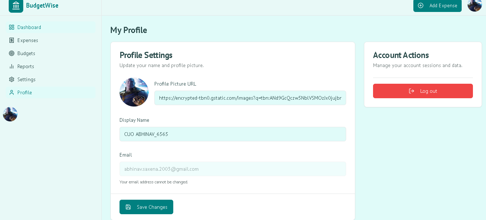

# BudgetWise

[](https://nextjs.org/)
[](https://firebase.google.com/)
[](https://tailwindcss.com/)
[](https://www.typescriptlang.org/)
[](https://ui.shadcn.com/)
[](https://lucide.dev/)
[](https://recharts.org/)
[](https://react-hook-form.com/)
[](https://zod.dev/)
[](https://firebase.google.com/docs/genkit)


**BudgetWise** is a modern, responsive web application for personal budget management and expense tracking. It helps users monitor spending, set budgets, and receive AI-powered financial advice to reach their financial goals effectively.  

Built with **Next.js**, **Firebase**, and **Genkit AI**, BudgetWise offers a seamless and interactive user experience.

## 📑 Table of Contents

- [Features](#-features)  
- [Tech Stack](#-🛠-tech-stack)  
- [Getting Started](#-getting-started)  
  - [Prerequisites](#prerequisites)  
  - [Firebase Setup](#1️⃣-firebase-setup)  
  - [Enable Firebase Services](#2️⃣-enable-firebase-services)  
  - [Install Dependencies](#3️⃣-install-dependencies)  
  - [Running the Application](#4️⃣-running-the-application) 
- [Contributing](#-contributing)  
- [License](#-license)  

---
## 🚀 Features

- **Authentication**  
  Secure sign-up and login using Email/Password and Google accounts.

- **Dashboard**  
  Get an at-a-glance overview of total spending, budget status, and recent transactions.

- **Expense Tracking**  
  Easily add, categorize, and manage your expenses.

- **Budget Management**  
  Create monthly budgets for different spending categories and track progress.

- **Visual Reports**  
  Interactive charts to visualize spending patterns and category breakdowns.

- **AI Personal Advisor**  
  Receive personalized suggestions to improve budgeting habits using Genkit AI.

- **User Profile**  
  Update display name and profile picture.

---

## 🛠 Tech Stack

- **Framework**: [Next.js](https://nextjs.org/) (App Router)  
- **Styling**: [Tailwind CSS](https://tailwindcss.com/)  
- **UI Components**: [ShadCN UI](https://ui.shadcn.com/)  
- **Language**: [TypeScript](https://www.typescriptlang.org/)  
- **Backend & Database**: [Firebase](https://firebase.google.com/) (Authentication, Firestore, Storage)  
- **Generative AI**: [Firebase Genkit](https://firebase.google.com/docs/genkit)  
- **Icons**: [Lucide React](https://lucide.dev/)  
- **Charts**: [Recharts](https://recharts.org/)  
- **Form Management**: [React Hook Form](https://react-hook-form.com/) & [Zod](https://zod.dev/)

---

## 📥 Getting Started

Follow these instructions to run the project locally.

### Prerequisites

- [Node.js](https://nodejs.org/) (v18 or later recommended)  
- `npm` or `yarn` package manager  
- Firebase account

---

### 1️⃣ Firebase Setup

1. Go to the [Firebase Console](https://console.firebase.google.com/).  
2. Create a new Firebase project or use an existing one.  
3. Navigate to **Project Settings > General**.  
4. Under **Your apps**, create a new **Web app**.  
5. Copy the `firebaseConfig` object provided.  
6. Update `src/firebase/config.ts` with your configuration.

---

### 2️⃣ Enable Firebase Services

Ensure the following services are enabled:

- **Authentication**: Enable Email/Password and Google sign-in providers.  
- **Firestore Database**: Create a Firestore database in **production mode**. Configure security rules appropriately.  
- **Storage**: Enable Firebase Storage for profile images and other assets.

---

### 3️⃣ Install Dependencies

Clone the repository and install dependencies:

```bash
git clone https://github.com/abhinavsaxena2308/BudgetWise-ExpenseTracker
cd BudgetWise-ExpenseTracker
npm install
```

### 4️⃣ Running the Application

Start the development server::

```bash
npm run dev
```

---
📸 Screenshots





